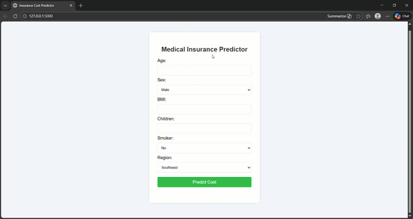

# insurance-premium-predictor

A Machine Learning web application built with **Flask** and **Scikit-Learn** that predicts insurance costs based on user health and demographic data.

## 🚀 Live Demo

## Features
* **Model:** Linear Regression with Feature Engineering (Interaction terms).
* **Accuracy:** Achieved an R-squared score of **86.45%**.
* **Tech Stack:** Python, Flask, Scikit-Learn, Pandas, HTML/CSS.

## 📋 How to run locally
1. Clone the repo: `git clone https://github.com/rahul09833/insurance-premium-predictor.git`
2. Install requirements: `pip install -r requirements.txt`
3. Run the app: `python app.py`
